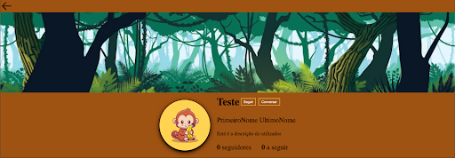
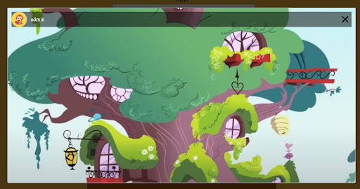

# MonkeySMedia

### My Personal SocialMedia

#### In this social network we will be able to make post so that our friends can see.

#### We can Post images, text. we can like posts and comment it. Follow our freinds, and be followed by them.

#### Each user will have their own profiles and will be able to change it how ever he want.

I used this app to learn about microfrontends with [SingleSPA](https://single-spa.js.org/docs/4.x/getting-started-overview/) (React - typescript) and [django](https://www.djangoproject.com/) with postgreSQL.

Here are some photos showing how the app is.

##### Create posts:
  

##### Post without image:
  

##### Post with image:
  

##### Delete feedback:
  

##### Profile Header:
  

##### Edit profile:
  

##### Search for posts or users:
  

##### Navigation:
  

##### Friends List:
  

##### Friends Chat:
  

##### Notifications page:
  

##### Authentication pages:
  
  

##### Settings page:
  
  

##### Stories:
  
  
